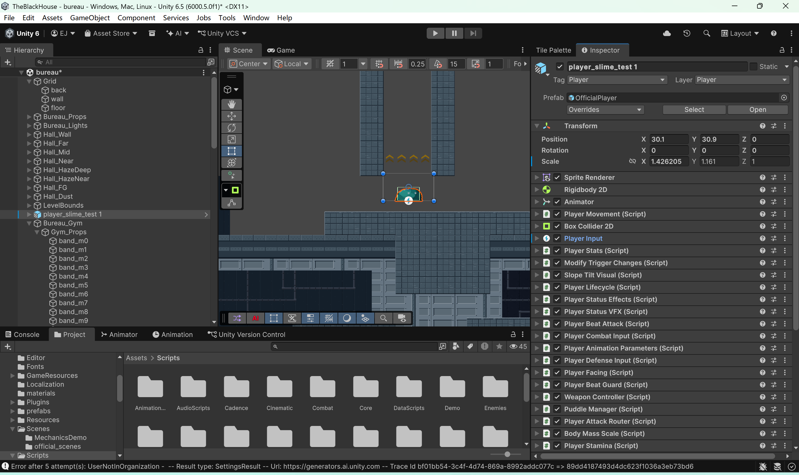

# Project [Codename] — Technical Showcase

## 🛡️ Repository Access & Privacy Notice
The main source code and proprietary assets for this indie game project are maintained in a **private repository** for intellectual property (IP) protection prior to release. This public showcase repository highlights system architecture, component design, and software engineering practices used during development.

---

## 📖 Overview & Mechanics
- **Engine & Language**: Unity (6.x) | C#
- **Genre**: Action-Adventure / Puzzle-Platformer
- **Core Concept**: Environmental traversal and puzzle-solving built around dynamic material properties (Gel, Mud, Rock) and wave-sensing mechanics.

---

## 🛠️ System Architecture & Engineering

### 1. Component-Based & Decoupled Architecture
To ensure scalability and maintainability, entity logic is decoupled into single-responsibility C# modules rather than monolithic manager scripts.



* **Single-Responsibility Modules**: Component separation allows independent handling of core systems (e.g., `Player Movement`, `Body Mass Scale`, `Puddle Manager`, `Beat Attack Router`).
* **Clean Workspace Hierarchy**: Organized script directories separating `Combat`, `Core`, `DataScripts`, `Enemies`, and `AudioScripts` for modular codebase maintenance.

---

### 💻 Code Architecture Sample (Event-Driven Communication)

Below is an abstract snippet demonstrating how environmental triggers broadcast data to game entities via dynamic C# events without creating hard dependencies:

```csharp
namespace GameCore.Events
{
    using System;
    using UnityEngine;

    public class WavePropagationManager : MonoBehaviour
    {
        // Decoupled event broadcast for environmental seismic mechanics
        public static event Action<float, Vector3> OnSeismicWaveTriggered;

        [SerializeField] private float defaultWaveSpeed = 12.0f;

        public void EmitWave(Vector3 originPosition, float amplitude)
        {
            if (amplitude <= 0f) return;

            // Notify all listening entities (e.g., player status, puzzle triggers)
            OnSeismicWaveTriggered?.Invoke(amplitude, originPosition);
        }
    }
}
